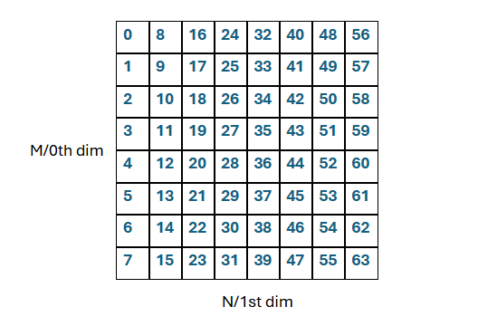
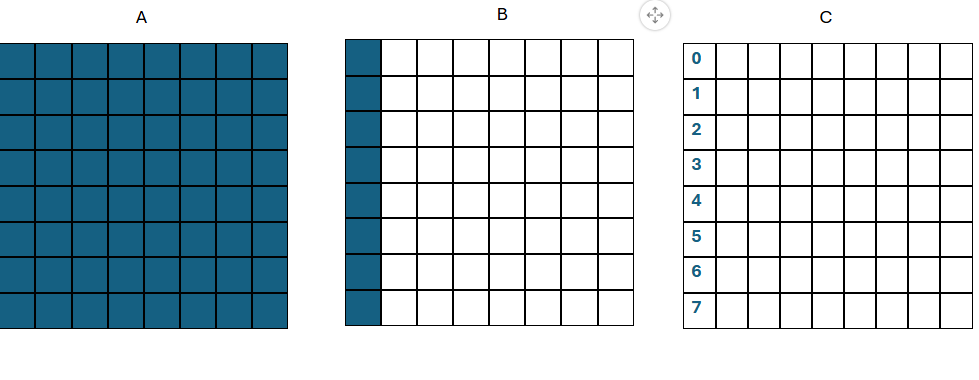
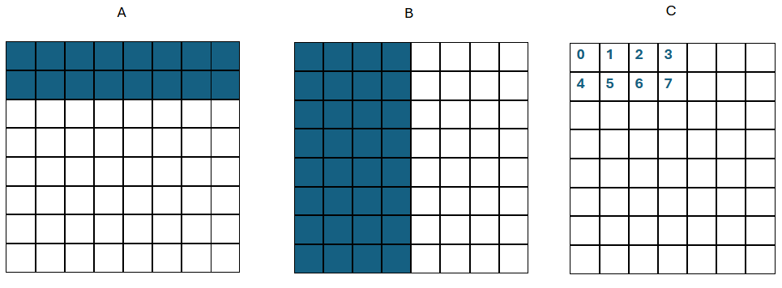

==============================
Workgroup Reordering in Wave
==============================

This document describes the workgroup reordering feature enabled in the Wave. Workgroup reordering has been shown to improve L2 cache hit rates for GEMM kernels,
and given how central GEMM operations are in machine learning, this mechanism offers kernel authors the opportunity to boost performance.

Overview
========

When executing a kernel, a grid of workgroups is launched. Each workgroup maps to a portion of the data being processed and executes instructions on that segment — this is known as *indexing*.
Workgroups contain *waves*, and waves contain *threads*. Each of these SIMD layers uses different indexing calculations, so workgroup reordering will focus specifically on workgroup indexing without affecting internal wave/thread indexing.

It's important to note that the dimensions of the data are distinct to the dimensions of the workgroup grid. A standard GEMM kernel computing `A × Bᵀ` uses these dimensions:

- Matrix A has shape `(M × K)`
- Matrix B has shape `(N × K)`
- The result matrix C has shape `(M × N)`

The workgroup grid has two dimensions: dimension 0 and dimension 1. Each workgroup `w` can be represented by coordinates `(wg0, wg1)`, where:

- `wg0` is the index along the 0th grid dimension
- `wg1` is the index along the 1st grid dimension

Workgroup-to-Data Mapping
=========================

Wave's `WorkgroupConstraint` is the feature linking the workgroup grid to the data matrices. For example, this code:

.. code-block:: python

    tkw.WorkgroupConstraint(M, BLOCK_M, 0)
    tkw.WorkgroupConstraint(N, BLOCK_N, 1)

distributes the M dimension of the data across the 0th workgroup grid dimension, and N across the 1st. Each workgroup thus handles `BLOCK_M` rows and `BLOCK_N` columns.

Flattened Workgroup Layout
==========================

Although conceptually visualized as a 2D grid, workgroups are stored linearly or "flattened" in hardware. The 0th dimension (`wg0`) is the "faster" dimension, meaning:

- workgroup `(0, 0)` → linear index 0 / flat workgroup id 0
- workgroup `(1, 0)` → linear index 1 / flat workgroup id 1
- workgroup `(2, 0)` → linear index 2 / flat workgroup id 2
- etc.

In other words, flattened workgroup ids follow the launch grid in column-major order.
Going back to our MXN C matrix, if the number of workgroups along both the 0th and 1st dimension of the launch grid are 8, the launch grid and its workgroup ids would map to the data as so:

Hardware Architecture and Cache Implications
============================================

On AMD GPUs, a *Compute Unit* (CU) handles a single workgroup. For instance, MI300X GPUs have:

- 40 CUs (38 active CUs) per *XCD* (Accelerator Complex Die)
- 4 MB Shared L2 cache among those CUs within an XCD

Example:
- XCD 1 → CUs 0–37 → Workgroups 0–37
- XCD 2 → CUs 0–37 → Workgroups 38–75

This implies that spatial locality of data within an XCD matters. The idea is that if CUs within the same XCD process neighboring data, L2 cache hit rates will improve. This is the motivator for reordering workgroups.

Default vs Reordered Launch Grids
=================================

Let's look at the column-major workgroup ordering for the same 8x8 output matrix from before.

We can see to calculate 8 output blocks for C, we have to read all 64 blocks of data from A and 8 blocks of data from B for a total of 72 blocks.

Instead of this default column-major workgroup order, we can apply a custom workgroup reordering strategy:

Here, we group 4 workgroups along the N dimension of the data (across 4 columns) before moving along the M dimension of the data (moving down a row) and assigning the next set of workgroups.
4 in this case can be considered the grouping factor, and after we have fully assigned all 4 columns to workgroups, we can start assigning workgroups to the next 4 columns in the same manner.
With this reordering, to compute 8 output blocks, we only need to read 48 total input blocks as opposed to 72 from before — reducing redundant memory reads and improving cache utilization.

Reordering Logic: Code Example
==============================

We can implement this reordering scheme as follows:

.. code-block:: python

    wg0, wg1 = WORKGROUP_0, WORKGROUP_1
    num_wg_0 = ceiling(M / BLOCK_M)

    # Flatten the workgroup index
    flat_wg_index = wg1 * num_wg_0 + wg0

    # Define group size
    num_wg_group = GROUP_SIZE_N * num_wg_0
    group_id = flat_wg_index // num_wg_group
    first_wg_id_1 = group_id * GROUP_SIZE_N

    # Compute new reordered coordinates
    new_wg0 = (flat_wg_index % num_wg_group) // GROUP_SIZE_N
    new_wg1 = first_wg_id_1 + (flat_wg_index % num_wg_group) % GROUP_SIZE_N

    # Apply constraints
    constraints += [tkw.ReorderingConstraint(new_wg0, 0)]
    constraints += [tkw.ReorderingConstraint(new_wg1, 1)]

Explanation
===========

Here, `wg0` and `wg1` represent the original workgroup coordinates. We:

1. Flatten the 2D index into a 1D linear index (`flat_wg_index`)
2. Define how many workgroups make up one "group"
3. Compute a new pair `(new_wg0, new_wg1)` representing the reordered coordinates

The `GROUP_SIZE_N` parameter is our grouping factor, and it controls how many columns of workgroups we pack together before moving to the next row of groups.

These new coordinates are then fed into `tkw.ReorderingConstraint`, which updates the launch grid accordingly, behind the scenes.

Results
=======

This section compares performance between normal and reordered workgroup scheduling across matrix shapes. Two key metrics are analyzed:

1. **L2 Cache Hit Rate**
2. **Kernel Execution Time**

The testing parameters used were:
1. BLOCK_M = 128
2. BLOCK_N = 128
3. BLOCK_K = 64
4. GROUP_SIZE_N = 4
5. waves_per_block = (2, 2, 1)
6. mfma_variant = MMAType.F32_16x16x16_F16
7. enable_scheduling = SchedulingType.PREFETCH

L2 Cache Hit Rate (%)
------------------

+-------------------------+----------------+------------------+
| Shape (M, N, K)         | Normal Wave    | Reordered Wave   |
+=========================+================+==================+
| 1024x1024x1024          | 45.52%         | 60.33%           |
+-------------------------+----------------+------------------+
| 2048x2048x2048          | 69.33%         | 77.87%           |
+-------------------------+----------------+------------------+
| 4096x4096x4096          | 78.60%         | 57.82%           |
+-------------------------+----------------+------------------+
| 4864x4096x4160          | 63.64%         | 71.01%           |
+-------------------------+----------------+------------------+
| 4864x8192x4160          | 63.64%         | 71.01%           |
+-------------------------+----------------+------------------+

Kernel Execution Time (ns)
---------------------------

+-------------------------+----------------+------------------+
| Shape (M, N, K)         | Normal Wave    | Reordered Wave   |
+=========================+================+==================+
| 1024x1024x1024          | 46385          | 41855            |
+-------------------------+----------------+------------------+
| 2048x2048x2048          | 95537          | 81024            |
+-------------------------+----------------+------------------+
| 4096x4096x4096          | 528360         | 526796           |
+-------------------------+----------------+------------------+
| 4864x4096x4160          | 529120         | 522786           |
+-------------------------+----------------+------------------+
| 4864x8192x4160          | 1065217        | 1045613          |
+-------------------------+----------------+------------------+

We can see that for 4 out of the 5 shapes, both cache hit rate increased and speed increased - which is a positive performance boost. Even for shape (4096, 4096, 4096) where the cache hit rate decreased, we still saw a slight speed boost.

Conclusion
==========

By using `ReorderingConstraint`, kernel authors can control how workgroups are mapped to data along the dimensions of the workgroup grid and explore different reordering schemes to provide potential performance boosts.
